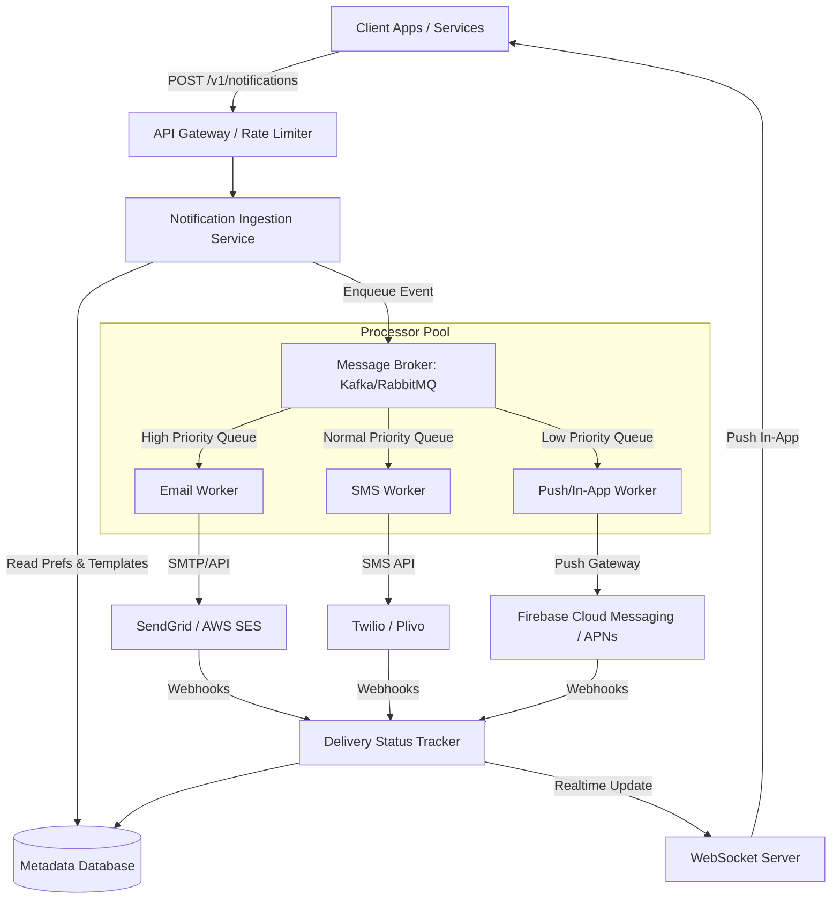

# Scalable Notification System Design

This document details the architecture, data models, APIs, and operational guidelines for a highly available, fault-tolerant, and scalable Notification System capable of delivering messages via Email, SMS, Mobile Push, and In-App channels.

---

## 1. System Requirements

### Functional Requirements
- **Multi-channel Delivery:** Support Email (e.g., SendGrid, SES), SMS (e.g., Twilio), Mobile Push (FCM, APNs), and In-App notification feeds.
- **User Preference Management:** Allow users to opt-in/opt-out of specific notification categories (e.g., transactional, promotional, security) and set channel preferences.
- **Dynamic Templates:** Support HTML and text templates with variables for personalization.
- **Delivery Status Tracking:** Track notifications from ingestion to final delivery status (sent, delivered, failed, read).
- **Scheduling:** Ability to send notifications immediately or schedule them for a future date/time.

### Non-Functional Requirements
- **High Availability & Reliability:** Minimise message loss; target $99.99\%$ delivery rate.
- **Low Latency:** High priority notifications (like 2FA codes) must be delivered within 5 seconds.
- **Idempotency (Deduplication):** Ensure notifications are not sent multiple times due to retries or network issues.
- **Scalability:** Scale horizontally to support surges in traffic (e.g., marketing campaigns sending millions of alerts).
- **Rate Limiting:** Protect users from spamming and avoid hitting downstream provider rate limits.

---

## 2. High-Level Architecture

The system uses an asynchronous, event-driven architecture to decouple notification ingestion from delivery, ensuring that surges in traffic do not crash downstream systems.



### Component Details
1. **API Gateway / Rate Limiter:** Authenticates requests, performs rate limiting per client service to prevent abuse, and routes requests to the Ingestion Service.
2. **Notification Ingestion Service:** Validates payloads, resolves templates, checks user preferences, generates a unique transaction ID, and publishes events to the appropriate message queues.
3. **Metadata Database (PostgreSQL/MongoDB):** Stores user preferences, notification history, delivery statuses, templates, and API keys.
4. **Message Broker (Kafka/RabbitMQ):** Implements queue prioritization (e.g., critical 2FA vs. marketing campaigns) and acts as a buffer.
5. **Worker Pool (Processors):** Consumers that pull jobs from queues, format the final payloads, call third-party provider APIs, and manage retries.
6. **Delivery Status Tracker:** Listens to webhooks from providers (SendGrid, Twilio, FCM) and updates the database status.
7. **WebSocket Server:** Powers the real-time push mechanism for the In-App notification feed.

---

## 3. Database Schema

We propose a relational database model (e.g., PostgreSQL) for transactional safety, structured relationship mapping, and indexing capabilities.

### `users` Table
Stores basic user information linked to notification channels.
| Column | Type | Constraints | Description |
| :--- | :--- | :--- | :--- |
| `id` | UUID | PRIMARY KEY, DEFAULT gen_random_uuid() | Unique identifier for the user. |
| `email` | VARCHAR(255) | UNIQUE, NOT NULL | User's email address. |
| `phone_number` | VARCHAR(20) | UNIQUE | User's mobile number (E.164 format). |
| `created_at` | TIMESTAMP | DEFAULT CURRENT_TIMESTAMP | Record creation timestamp. |

### `user_preferences` Table
Allows users to configure which notification types they want to receive on which channels.
| Column | Type | Constraints | Description |
| :--- | :--- | :--- | :--- |
| `user_id` | UUID | FOREIGN KEY REFERENCES users(id) | The associated user. |
| `category` | VARCHAR(50) | NOT NULL | Category (e.g., `MARKETING`, `SECURITY`, `TRANSACTIONAL`). |
| `channel` | VARCHAR(20) | NOT NULL | Channel (e.g., `EMAIL`, `SMS`, `PUSH`, `IN_APP`). |
| `enabled` | BOOLEAN | DEFAULT TRUE | Preference opt-in/opt-out toggle. |

> [!NOTE]
> Composite primary key is defined on `(user_id, category, channel)` to prevent duplicate settings.

### `notification_logs` Table
Tracks every notification request and its lifecycle state.
| Column | Type | Constraints | Description |
| :--- | :--- | :--- | :--- |
| `id` | UUID | PRIMARY KEY, DEFAULT gen_random_uuid() | Unique identifier for each message sent. |
| `user_id` | UUID | FOREIGN KEY REFERENCES users(id) | Target recipient. |
| `idempotency_key`| VARCHAR(255) | UNIQUE, NULLABLE | Client-provided key to prevent duplicate sends. |
| `category` | VARCHAR(50) | NOT NULL | Category classification. |
| `channel` | VARCHAR(20) | NOT NULL | Chosen delivery channel. |
| `status` | VARCHAR(20) | NOT NULL | Lifecycle: `PENDING`, `SENT`, `DELIVERED`, `FAILED`. |
| `retry_count` | INTEGER | DEFAULT 0 | Count of delivery attempts. |
| `error_message` | TEXT | NULLABLE | Error trace if the message failed. |
| `created_at` | TIMESTAMP | DEFAULT CURRENT_TIMESTAMP | Ingestion time. |
| `updated_at` | TIMESTAMP | DEFAULT CURRENT_TIMESTAMP | State modification time. |

---

## 4. API Specification

### 1. Send Notification
Sends a notification to a specific user. Supports idempotency keys to ensure safety.

- **URL:** `/api/v1/notifications`
- **Method:** `POST`
- **Headers:**
  - `Content-Type: application/json`
  - `Authorization: Bearer <token>`
  - `X-Idempotency-Key: <unique_uuid>`
- **Request Body:**
```json
{
  "userId": "c5f5ad18-1e4c-473d-82d2-8f9293ee065b",
  "category": "TRANSACTIONAL",
  "channels": ["EMAIL", "PUSH"],
  "templateName": "welcome_email",
  "templateData": {
    "userName": "Alice",
    "activationUrl": "https://example.com/activate?code=123"
  },
  "priority": "HIGH"
}
```
- **Response (`202 Accepted`):**
```json
{
  "status": "accepted",
  "messageId": "9b1deb4d-3b7d-4bad-9bdd-2b0d7b3dcb6d",
  "channelsEnqueued": ["EMAIL", "PUSH"],
  "timestamp": "2026-06-05T03:55:00Z"
}
```

### 2. Update Preferences
Allows a user to update their opt-in settings.

- **URL:** `/api/v1/preferences`
- **Method:** `PUT`
- **Headers:**
  - `Content-Type: application/json`
  - `Authorization: Bearer <token>`
- **Request Body:**
```json
{
  "preferences": [
    {
      "category": "MARKETING",
      "channel": "EMAIL",
      "enabled": false
    },
    {
      "category": "SECURITY",
      "channel": "SMS",
      "enabled": true
    }
  ]
}
```
- **Response (`200 OK`):**
```json
{
  "status": "success",
  "message": "Preferences updated successfully."
}
```

---

## 5. Reliability & Fault Tolerance

### Idempotency (Deduplication)
To prevent duplicate notifications (e.g., charging a user twice, sending duplicate MFA codes due to a timeout retry):
1. Clients generate a unique `X-Idempotency-Key` (typically UUID v4) for every request.
2. The Ingestion Service checks if the key already exists in a fast cache (e.g., Redis) or the database.
3. If it exists, the service returns the cached response of the previous request instead of reprocessing.

### Retries with Exponential Backoff & Jitter
When a third-party provider (e.g., SendGrid) returns a transient error (5xx, rate limits):
1. Workers catch the exception and calculate a delay:
   $$t_{wait} = 2^{attempt} \times base\_delay + rand\_jitter$$
2. The message is pushed to a delayed queue/topic.
3. If the maximum retry count (e.g., 5 attempts) is reached, the message is routed to a **Dead Letter Queue (DLQ)** for human inspection or automated fallback alerting.

### Rate Limiting and Quota Management
- **User protection:** Limit notifications of specific categories (e.g., marketing) to a maximum of $N$ per day per user.
- **Provider protection:** Keep outgoing requests below vendor rate limits. If limit thresholds are reached, dynamically throttle queue processing.

---

## Stage 1: Priority Inbox System Design

### 1. Algorithmic Processing Matrix
To surface critical notifications efficiently without database queries, the frontend performs an in-memory priority evaluation:
- **Categorization Weights:** `Placement` (Weight = 3) > `Result` (Weight = 2) > `Event` (Weight = 1).
- **Recency Evaluation:** Timestamps are parsed into Epoch milliseconds to guarantee true chronological sorting.
- **Tie-Breaking Strategy:** Sorting occurs primarily on timestamp recency. If multiple alerts share an identical millisecond timestamp, the Type Weight acts as the evaluation tie-breaker.

### 2. Time and Space Complexity
- **Time Complexity:** $O(N \log N)$ due to the merge-sort mechanics of JavaScript's native sorting architecture.
- **Space Complexity:** $O(N)$ memory allocation to isolate sorting execution streams from the global React application state context.
